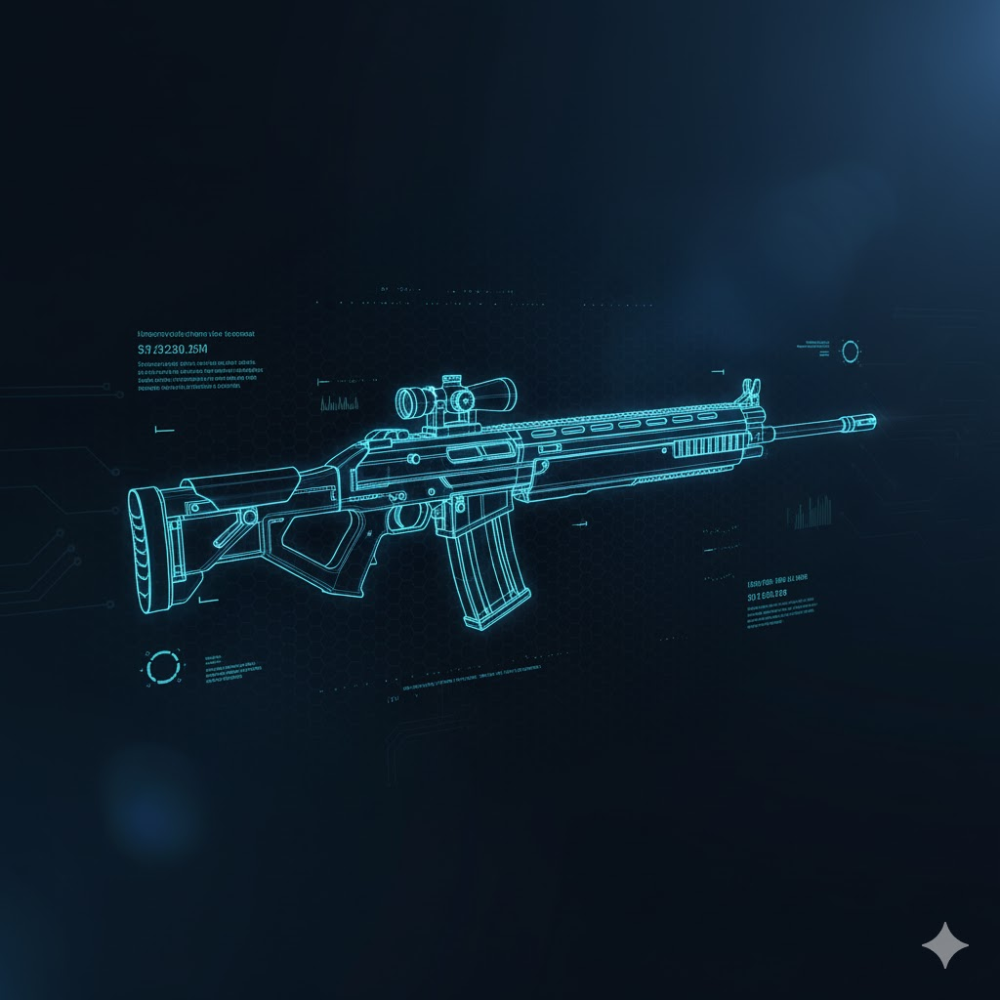

# Full Rubber Jacket 🎮

A real-time 1v1 multiplayer first-person shooter built with Three.js, Node.js, and WebSockets. Features stunning visuals with a dark Material UI theme and custom background imagery.



## ✨ Features

- **User Authentication**: Secure register/login system with bcrypt password hashing
- **Real-time Matchmaking**: Automatic 1v1 player pairing system
- **WebSocket Multiplayer**: Low-latency real-time gameplay synchronization
- **Fast-Paced Combat**: One-hit-kill mechanics with instant respawn
- **Score Tracking**: First to 5 kills wins the match
- **Game History**: Comprehensive match statistics and win/loss records
- **3D Graphics**: Powered by Three.js with realistic physics and collision detection
- **Modern UI**: Dark Material UI theme with glass morphism effects and smooth animations
- **Custom Backgrounds**: Stunning visual design with custom imagery

## 🚀 Quick Start

### Installation

1. **Clone or download the project**

2. **Install dependencies:**
```bash
npm install
```

3. **Start the server:**
```bash
npm start
# or
node server.js
```

4. **Open your browser:**
```
http://localhost:3000/login.html
```

## 🎮 How to Play

### Getting Started
1. **Register/Login**: Create an account or login at `/login.html`
2. **Find Match**: Click "Find Match" in the lobby to search for an opponent
3. **Play**: Once matched, the game automatically starts in 2 seconds

### Game Controls
- **W/A/S/D**: Move forward/left/backward/right
- **SPACE**: Jump
- **MOUSE**: Look around (first-person view)
- **LEFT CLICK**: Shoot (one-hit-kill)
- **ESC**: Release pointer lock (pause game)

### Game Rules
- ⚡ **First to 5 kills** wins the match
- 💀 **One-hit-kill** mechanics - every shot counts!
- ⏱️ **2-second respawn** delay after death
- 🎲 **Random spawn locations** to keep gameplay fair
- 🏆 **Winner saved** to match history database

## 🌐 Playing with Friends

### Option 1: Same WiFi Network (Easiest!)

Perfect if your friend is at your house or on the same network:

1. **Find your local IP address:**
   - **Windows**: Open Command Prompt → type `ipconfig`
     - Look for "IPv4 Address" (usually `192.168.1.XXX`)
   - **Mac/Linux**: Open Terminal → type `ifconfig` or `ip addr`

2. **Update server.js** (line 450):
   ```javascript
   server.listen(PORT, '0.0.0.0', () => {
       console.log(`Server running on http://localhost:${PORT}`);
       console.log(`Network: http://YOUR_LOCAL_IP:${PORT}`);
   });
   ```

3. **Share the link:**
   - **You**: Visit `http://localhost:3000/login.html`
   - **Friend**: Visit `http://YOUR_LOCAL_IP:3000/login.html`
     - Example: `http://192.168.1.15:3000/login.html`

4. **Firewall**: Ensure Windows Firewall allows Node.js or port 3000

---

### Option 2: Internet Play with ngrok (Recommended!)

Play with anyone, anywhere in the world:

1. **Download ngrok**:
   - Go to https://ngrok.com/
   - Sign up (free tier available)
   - Download and install

2. **Authenticate ngrok** (one-time setup):
   ```bash
   ngrok config add-authtoken YOUR_AUTH_TOKEN
   ```

3. **Start your game server:**
   ```bash
   node server.js
   ```

4. **In a new terminal, start ngrok:**
   ```bash
   ngrok http 3000
   ```

5. **Share the URL**:
   - ngrok will display a URL like: `https://abc123.ngrok.io`
   - Both you and your friend use this URL
   - Example: `https://abc123.ngrok.io/login.html`

**Note**: Free ngrok URLs change every time you restart. For permanent URLs, upgrade to a paid plan.

---

### Option 3: Cloud Deployment (Best for Always-On)

Deploy to a cloud service for 24/7 availability:

#### **Render.com** (Easiest, Free Tier Available)
1. Push your code to GitHub
2. Sign up at https://render.com
3. Create new "Web Service"
4. Connect your GitHub repo
5. Build command: `npm install`
6. Start command: `node server.js`
7. Share your Render URL: `https://your-game.onrender.com`

#### **Railway.app** (Simple, Free Trial)
1. Sign up at https://railway.app
2. "New Project" → "Deploy from GitHub"
3. Select your repo
4. Railway auto-detects Node.js
5. Share your Railway URL

#### **Other Options:**
- **DigitalOcean**: $4/month VPS
- **Heroku**: No longer has free tier
- **AWS/Azure**: Free tier available but complex setup

---

## 📁 Project Structure

```
FPS/
├── server.js              # Main server with WebSocket handling & authentication
├── database.js            # SQLite database initialization
├── package.json           # Dependencies and scripts
│
├── login.html             # Login/Register page (with login.jpg background)
├── lobby.html             # Matchmaking lobby (with background.jpg)
├── game.html              # Main multiplayer FPS game (Three.js)
├── history.html           # Match history & statistics (with background.jpg)
├── index.html             # Original single-player demo
│
├── login.jpg              # Custom login page background
├── background.jpg         # Custom background for lobby/history
│
├── models/gltf/           # 3D models
│   └── collision-world.glb
├── build/                 # Three.js core library
│   └── three.module.js
└── jsm/                   # Three.js addons
    ├── loaders/GLTFLoader.js
    ├── math/Octree.js
    ├── math/Capsule.js
    └── libs/stats.module.js
```

## 🗄️ Database Schema

### Users Table
```sql
CREATE TABLE users (
    id INTEGER PRIMARY KEY AUTOINCREMENT,
    username TEXT UNIQUE NOT NULL,
    password TEXT NOT NULL,              -- bcrypt hashed
    created_at DATETIME DEFAULT CURRENT_TIMESTAMP
);
```

### Games Table
```sql
CREATE TABLE games (
    id INTEGER PRIMARY KEY AUTOINCREMENT,
    player1_id INTEGER NOT NULL,         -- FK to users.id
    player2_id INTEGER NOT NULL,         -- FK to users.id
    winner_id INTEGER NOT NULL,          -- FK to users.id
    player1_score INTEGER NOT NULL,
    player2_score INTEGER NOT NULL,
    started_at DATETIME DEFAULT CURRENT_TIMESTAMP,
    ended_at DATETIME DEFAULT CURRENT_TIMESTAMP
);
```

## 🔌 API Endpoints

### Authentication
| Method | Endpoint | Description | Auth Required |
|--------|----------|-------------|---------------|
| POST | `/api/register` | Register new user | No |
| POST | `/api/login` | Login user | No |
| POST | `/api/logout` | Logout user | No |
| GET | `/api/me` | Get current user info | Yes |
| GET | `/api/wstoken` | Get WebSocket token | Yes |

### Game Data
| Method | Endpoint | Description | Auth Required |
|--------|----------|-------------|---------------|
| GET | `/api/history` | Get user's match history | Yes |

## 🔄 WebSocket Events

### Client → Server
| Event | Payload | Description |
|-------|---------|-------------|
| `findMatch` | `{}` | Start matchmaking |
| `cancelMatch` | `{}` | Cancel matchmaking |
| `rejoinGame` | `{gameId}` | Rejoin after reconnection |
| `playerUpdate` | `{position, rotation}` | Send position/rotation |
| `shoot` | `{position, direction}` | Fire weapon |
| `hit` | `{}` | Report hit on opponent |

### Server → Client
| Event | Payload | Description |
|-------|---------|-------------|
| `connected` | `{username, userId}` | WebSocket connected |
| `searching` | `{}` | Searching for opponent |
| `matchFound` | `{gameId, opponent, playerNumber}` | Match found |
| `gameRejoined` | `{gameId, scores}` | Successfully rejoined |
| `opponentUpdate` | `{position, rotation}` | Opponent moved |
| `opponentShoot` | `{position, direction}` | Opponent shot |
| `died` | `{}` | You were killed |
| `scored` | `{}` | You got a kill |
| `scoreUpdate` | `{scores}` | Current match scores |
| `gameOver` | `{winnerId, scores}` | Match ended |
| `opponentDisconnected` | `{message}` | Opponent left |

## 🎨 UI/UX Features

### Dark Material UI Theme
- **Color Palette**:
  - Background: Dark gradients (#1a1a2e, #16213e, #0f3460)
  - Primary: Light blue (#90caf9, #64b5f6, #42a5f5)
  - Success: Green (#4caf50)
  - Error: Red (#f44336)

### Visual Effects
- ✨ **Glass Morphism**: Frosted glass effect with backdrop blur
- 🌊 **Gradient Animations**: Slowly shifting background gradients
- 💫 **Smooth Transitions**: 0.3s ease transitions on all interactions
- 🎭 **Hover Effects**: Scale, glow, and elevation on hover
- 🌈 **Gradient Text**: Shiny gradient titles
- 🔵 **Ripple Effects**: Expanding circles on button clicks
- ⚡ **Shimmer Effects**: Light sweeps across elements
- 📊 **Staggered Animations**: Sequential fade-ins
- 🎪 **Floating Animations**: Gentle up/down motion

### Custom Backgrounds
- **login.jpg**: Used on login/register page
- **background.jpg**: Used on lobby and history pages
- Dark overlays (70-75% opacity) ensure text readability
- Backdrop blur for modern aesthetic

## 🛠️ Technologies Used

### Frontend
- **Three.js**: 3D graphics and rendering
- **Vanilla JavaScript**: ES6+ modules
- **HTML5**: Semantic markup
- **CSS3**: Custom animations and Material Design

### Backend
- **Node.js**: JavaScript runtime
- **Express.js v5.1.0**: Web framework
- **WebSocket (ws) v8.18.3**: Real-time communication

### Database & Authentication
- **SQLite3**: Lightweight SQL database
- **bcrypt**: Password hashing
- **jsonwebtoken**: JWT authentication
- **cookie-parser**: Cookie management

### Game Engine
- **Octree**: Spatial partitioning for collision detection
- **Capsule Collider**: Player physics
- **GLTFLoader**: 3D model loading
- **Stats.js**: Performance monitoring

## 🐛 Bug Fixes & Improvements

### Major Fixes
1. ✅ **Fixed WebSocket Reconnection**: Implemented `rejoinGame` mechanism with 10-second grace period
2. ✅ **Fixed Duplicate Hit Registration**: Added bullet ownership tracking (`isMyBullet` flag)
3. ✅ **Fixed Both Players Respawning**: Only victim respawns now
4. ✅ **Fixed Opponent Not Visible**: Proper game state initialization from URL params
5. ✅ **Fixed Shots Not Registering**: Server properly broadcasts opponent shots

### Performance Optimizations
- Object pooling for bullets (50 spheres reused)
- Throttled position updates (60 Hz)
- Efficient collision detection with Octree

## 🔒 Security Considerations

**⚠️ This is a development version. Before production deployment:**

1. **Change JWT Secret**:
   ```javascript
   const JWT_SECRET = process.env.JWT_SECRET || 'your-super-secret-key';
   ```

2. **Use HTTPS/WSS**:
   - HTTP → HTTPS
   - WS → WSS (secure WebSockets)

3. **Add Rate Limiting**:
   ```bash
   npm install express-rate-limit
   ```

4. **Input Validation**:
   - Sanitize user inputs
   - Validate all WebSocket messages

5. **Environment Variables**:
   ```bash
   npm install dotenv
   ```

6. **CORS Configuration**:
   ```javascript
   app.use(cors({ origin: 'your-domain.com' }));
   ```

7. **Session Security**:
   - Secure cookie flags
   - CSRF protection
   - Session expiration

8. **Server-Side Validation**:
   - Validate hit detection server-side
   - Add anti-cheat measures
   - Rate limit position updates

## 📊 Game Mechanics

### Movement System
- Ground speed: 25 units/second
- Air speed: 8 units/second (reduced air control)
- Jump velocity: 15 units
- Gravity: 30 units/second²

### Combat System
- Bullet speed: 35 units/second + player momentum
- Hit detection: Distance-based (0.9 unit radius)
- Damage: One-hit-kill
- Respawn delay: 2 seconds

### Matchmaking
- Queue-based pairing (FIFO)
- Automatic match creation
- Player identification via JWT
- Game instance management

## 🎯 Known Limitations

1. **Client-Side Hit Detection**: Vulnerable to manipulation (consider server-side validation)
2. **No Anti-Cheat**: Position and hit validation needed
3. **No Lag Compensation**: No client prediction or interpolation
4. **High Bandwidth**: Full position sent every frame (consider delta compression)
5. **Two-Player Only**: Current architecture supports 1v1 only

## 🚧 Future Enhancements

- [ ] Server-side hit validation
- [ ] Client-side prediction
- [ ] Lag compensation
- [ ] Spectator mode
- [ ] Multiple game modes (Team Deathmatch, Free-for-All)
- [ ] Weapon variety
- [ ] Power-ups and pickups
- [ ] Leaderboards
- [ ] Friend system
- [ ] Voice chat integration
- [ ] Mobile support

## 📝 Credits

- **Three.js**: Foundation for 3D graphics
- **Collision Detection**: Based on Three.js Octree example
- **Multiplayer Architecture**: Custom WebSocket implementation
- **UI Design**: Material Design principles with custom effects

## 📄 License

This project is for educational purposes. Feel free to modify and extend for learning.

---

## 💡 Tips for Best Experience

1. **Use a good internet connection** for smooth multiplayer
2. **Enable hardware acceleration** in your browser
3. **Use Chrome or Firefox** for best Three.js performance
4. **Close unnecessary tabs** to free up GPU resources
5. **Adjust graphics settings** if experiencing lag (coming soon!)

---

## 🤝 Contributing

Want to improve Full Rubber Jacket? Here's how:

1. Fork the repository
2. Create a feature branch (`git checkout -b feature/amazing-feature`)
3. Commit your changes (`git commit -m 'Add amazing feature'`)
4. Push to the branch (`git push origin feature/amazing-feature`)
5. Open a Pull Request

---

## 📞 Support

Having issues? Check out:
- Review the console logs (F12 in browser)
- Check server terminal for errors
- Ensure all dependencies are installed
- Verify port 3000 is not in use
- Check firewall settings for local network play

---

**Built with ❤️ for VIT Internet and Web Programming Course**

**Game Name**: Full Rubber Jacket 🎮
**Version**: 1.0.0
**Last Updated**: October 2025
